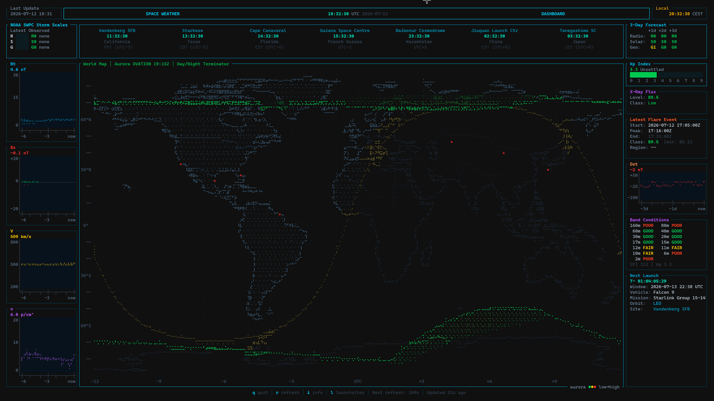

# NOAA SWPC Space Weather Terminal Dashboard

A modern, real-time terminal UI dashboard that displays space weather data from NOAA's Space Weather Prediction Center (SWPC). Built with Rust and Ratatui, this application provides a comprehensive view of solar activity, geomagnetic conditions, and their potential impact on Earth.



## Features

### Real-Time Data Display
- **RSG Storm Scales**: Current Radio Blackout (R), Solar Radiation Storm (S), and Geomagnetic Storm (G) levels with color-coded severity
- **3-Day Forecast**: Predicted storm activity for the next three days
- **Solar Wind Data**: 6-hour braille sparkline graphs of magnetic field strength (Bt), Bz component, solar wind speed, and proton density
- **World Map Visualization**: High-resolution braille world map using Natural Earth coastline data (5,125 points), with live NOAA OVATION aurora oval (intensity-colored green → yellow → red), day/night terminator, inland sea detection, country borders, and launch site markers
- **Kp Index**: Current planetary K-index with visual gauge
- **X-Ray Flux**: Current solar flare class with color-coded indicator
- **Latest Flare Event**: Details of the most recent solar flare (class, start/peak/end times)
- **Dst Index**: 24-hour Disturbance Storm Time graph for geomagnetic storm monitoring
- **HF Band Conditions**: Estimated propagation quality for amateur radio bands (160m through 2m) based on Solar Flux Index and Kp
- **Upcoming Launch**: Next rocket launch from a tracked spaceport with live countdown timer, sourced from Launch Library 2
- **Launch Site Clocks**: Real-time local time display for major spaceports worldwide
- **Audio Alerts**: Optional WAV audio notifications when NOAA storm scale levels increase (G/S/R) or a new X-class flare is detected. Off by default — toggle with `a` (requires audio device; dashboard runs fine without one)

### Interactive Features
- **Auto-refresh**: Space weather data updates every 5 minutes; launch data refreshes hourly
- **Manual refresh**: Press `r` to force an immediate data refresh
- **Responsive layout**: Adapts to terminal window size
- **Clean exit**: Press `q` or `Ctrl+C` to quit gracefully

### Data Sources
All space weather data is fetched from NOAA SWPC public APIs:
- RSG scales and 3-day forecast: https://services.swpc.noaa.gov/products/noaa-scales.json
- Solar wind magnetic field: https://services.swpc.noaa.gov/json/rtsw/rtsw_mag_1m.json
- Solar wind plasma data: https://services.swpc.noaa.gov/json/rtsw/rtsw_wind_1m.json
- Aurora nowcast (OVATION Prime): https://services.swpc.noaa.gov/json/ovation_aurora_latest.json
- Solar flare events: https://services.swpc.noaa.gov/json/goes/primary/xray-flares-latest.json
- Kp-index: https://services.swpc.noaa.gov/products/noaa-planetary-k-index.json
- Dst index: https://services.swpc.noaa.gov/products/kyoto-dst.json
- 10.7cm solar flux: https://services.swpc.noaa.gov/products/summary/10cm-flux.json
- 3-day text forecast: https://services.swpc.noaa.gov/text/3-day-forecast.txt

Launch data from [Launch Library 2](https://thespacedevs.com/llapi).

## Requirements

- **Rust**: 1.70 or newer (2021 edition)
- **Terminal**: Minimum size of 120x30 characters recommended (160x40 for optimal viewing)
- **Internet connection**: Required for fetching real-time data from NOAA SWPC and Launch Library 2 APIs

## Installation

### Prebuilt Binaries

Download the latest release for Linux (`.tar.gz`) or Windows (`.zip`) from the [Releases page](https://github.com/Kracht/Solardash/releases). Extract and run `solardash` (or `solardash.exe`) from the extracted folder — keep the `audio/` directory next to the binary if you want audio alerts.

### From Source

1. **Clone the repository**:
   ```bash
   git clone https://github.com/Kracht/Solardash.git
   cd Solardash
   ```

2. **Build the project**:
   ```bash
   cargo build --release
   ```

   The compiled binary will be located at `target/release/solardash`

### Dependencies

The project uses the following main dependencies:
- **ratatui** (0.29): Terminal UI framework
- **crossterm** (0.28): Cross-platform terminal manipulation
- **tokio** (1.42): Async runtime for concurrent data fetching
- **reqwest** (0.12): HTTP client for API requests
- **serde** (1.0) & **serde_json** (1.0): JSON parsing
- **chrono** (0.4) & **chrono-tz** (0.10): Date, time, and timezone handling
- **rodio** (0.19): Audio playback for alert notifications
- **anyhow** (1.0): Error handling

All dependencies are managed by Cargo and will be automatically downloaded during the build process.

## Usage

### Running the Dashboard

#### Development mode:
```bash
cargo run
```

#### Release mode (optimized):
```bash
cargo run --release
```

#### Running the compiled binary:
```bash
./target/release/solardash
```

### Keyboard Controls

| Key | Action |
|-----|--------|
| `q` / `Esc` | Quit the application |
| `Ctrl+C` | Force quit |
| `r` | Manually refresh all data |
| `i` | Toggle metric info overlay |
| `l` | Toggle launch site connector lines |
| `a` | Toggle audio alerts (off by default) |

### Terminal Setup

For the best experience:
1. Use a terminal with good Unicode support (most modern terminals)
2. Set your terminal to at least 120x30 characters (160x40 recommended)
3. Use a dark background for optimal color contrast
4. Ensure your terminal supports 256 colors or true color

## Dashboard Layout

The dashboard is organized into several key sections:

### Header Section (Top)
- **Left**: Last update timestamp (UTC)
- **Center**: Current UTC time and date (large format)
- **Right**: Local time display

### Launch Site Clocks
Real-time local clocks for major spaceports: Cape Canaveral, Vandenberg, Starbase, Kourou, Baikonur, Jiuquan, and Tanegashima.

### RSG Storm Scale Bar
- Current storm levels for Radio Blackout (R), Solar Radiation (S), and Geomagnetic (G) scales
- Color-coded severity indicators (Green -> Yellow -> Orange -> Red -> Dark Red)
- 3-day forecast matrix showing predicted activity levels

### Three-Panel Layout

#### Left Panel - Solar Wind (SWEPAM 6h)
Braille sparkline charts displaying 6-hour data for:
- Magnetic field total strength (Bt) in nT
- Magnetic field Bz component in nT (with positive/negative coloring)
- Solar wind speed in km/s
- Proton density in particles/cm3

#### Center Panel - World Map
- High-resolution braille Unicode world map (Natural Earth 5,125-point coastline dataset)
- Aurora oval from the NOAA OVATION Prime nowcast, colored by activity (green → yellow → red); falls back to a Kp-derived boundary if the feed is unavailable
- Day/night terminator line with land fill shading
- Country borders for major nations
- Launch site cross markers (`+`) for tracked spaceports
- Inland sea detection (Mediterranean, Black Sea, Caspian, etc.)
- Geographic latitude scale and UTC offset axis

#### Right Panel - Events & Forecasts
- Current Kp-index with visual gauge
- X-ray flux level (current flare class)
- Latest solar flare event details (class, start/peak/end times)
- 24-hour Dst (Disturbance Storm Time) index graph
- HF band conditions (160m-2m) with Good/Fair/Poor indicators
- Upcoming launch panel with live countdown, vehicle, mission, orbit, and launch site

## Project Structure

```
solardash/
├── Cargo.toml           # Project configuration and dependencies
├── README.md            # This file
├── solardash.png         # Screenshot
├── audio/               # WAV alert sounds (G1-G3, S1-S3, R1-R3, XClass)
└── src/
    ├── main.rs          # Application entry point and UI rendering
    ├── lib.rs           # Library root module
    ├── alerts.rs        # Audio alert system for storm scale transitions
    ├── api.rs           # API client for NOAA SWPC and Launch Library 2 endpoints
    ├── data.rs          # Data structures and parsing logic
    ├── map.rs           # Braille world map rendering, aurora overlay, and flood fill
    ├── world_data.rs    # Natural Earth high-resolution coastline coordinates (5,125 points)
    ├── colors.rs        # RGB color theme constants
    └── bin/
        └── test_api.rs  # Standalone API testing utility
```

## Development

### Building for Development
```bash
cargo build
```

### Running Tests
```bash
cargo test
```

### Checking Code Quality
```bash
# Run Clippy for linting
cargo clippy

# Format code
cargo fmt
```

### Testing API Connectivity
A standalone test utility is included to verify API connectivity:
```bash
cargo run --bin test_api
```

This will fetch and display data from all NOAA SWPC endpoints without starting the full UI.

## Troubleshooting

### Common Issues

**"No Data" displayed in panels:**
- Check your internet connection
- Verify NOAA SWPC services are online: https://www.swpc.noaa.gov/
- Try manually refreshing with the `r` key

**Layout appears broken or garbled:**
- Ensure your terminal size is at least 120x30 characters
- Verify your terminal supports Unicode characters (braille characters U+2800-U+28FF are used extensively)
- Try resizing the terminal window

**Colors not displaying correctly:**
- Ensure your terminal supports 256 colors or true color
- Try a different terminal emulator (recommended: Alacritty, Kitty, iTerm2, Windows Terminal)

**Application won't compile:**
- Verify Rust version: `rustc --version` (requires 1.70+)
- Update Rust: `rustup update`
- Clean build artifacts: `cargo clean` then `cargo build`

## Performance Notes

- Space weather data refreshes every 5 minutes; launch data refreshes every hour
- UI updates at approximately 1 Hz for smooth clock display
- Network requests are async and non-blocking (9 concurrent NOAA fetches via tokio::join)
- Memory footprint is typically under 10MB

## Acknowledgments

- Space weather data provided by [NOAA Space Weather Prediction Center (SWPC)](https://www.swpc.noaa.gov/)
- Launch data provided by [The Space Devs - Launch Library 2](https://thespacedevs.com/llapi)
- World map coastline data from [Natural Earth](https://www.naturalearthdata.com/) via [gnuplotting.org](http://www.gnuplotting.org/plotting-the-world-revisited/)
- Built with [Ratatui](https://github.com/ratatui/ratatui) terminal UI framework

## Additional Resources

- [NOAA SWPC Homepage](https://www.swpc.noaa.gov/)
- [SWPC Data Products](https://www.swpc.noaa.gov/products-and-data)
- [Space Weather Scales Explained](https://www.swpc.noaa.gov/noaa-scales-explanation)
- [Ratatui Documentation](https://docs.rs/ratatui/)

---

**Note**: This is a real-time monitoring tool. For critical space weather alerts and warnings, always refer to official NOAA SWPC bulletins and alerts at https://www.swpc.noaa.gov/
